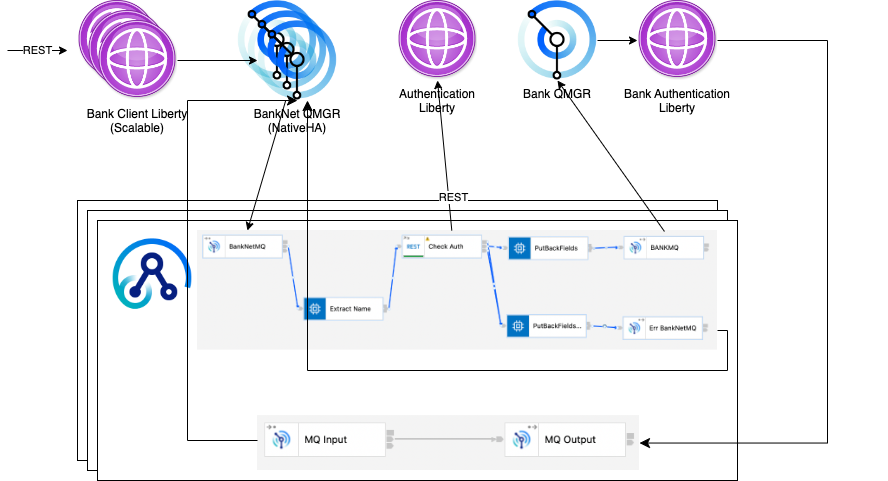

# Demo with MQ, ACE, Liberty on OCP



```
curl -k -v -H "Content-Type: application/json" -H "Accept: application/json" -d '{"customerName":"Brian","swiftCode":"ABCDEFHSS","IBAN":"12345","currency":"EUR","amount":123456.00}' -X POST https://{ocp-url}/BankClient/services/withdrawal
```
